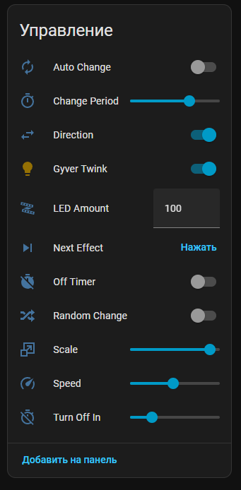
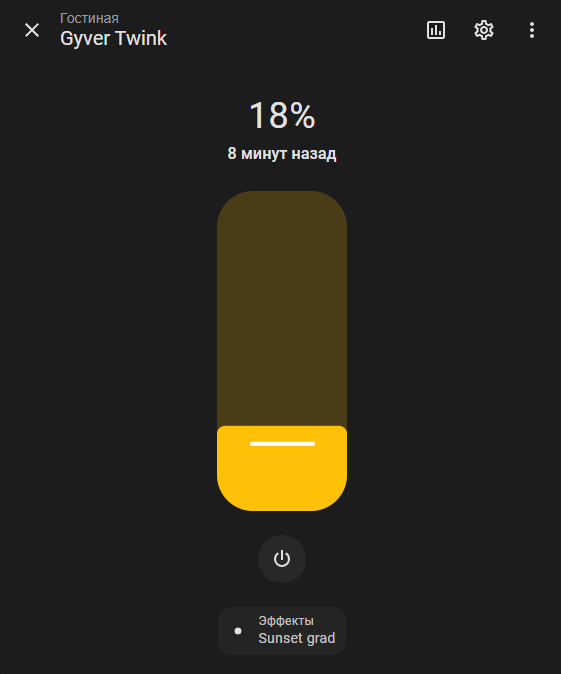

# GyverTwink для Home Assistant

[](https://github.com/DmitryKolyadin/GyverTwinkHA/releases)
[](https://github.com/DmitryKolyadin/GyverTwinkHA/blob/main/LICENSE)
[](https://github.com/DmitryKolyadin/GyverTwinkHA)
[](https://github.com/hacs/integration)

Интеграция для управления умной гирляндой [GyverTwink](https://alexgyver.ru/gyvertwink/) от AlexGyver в системе автоматизации Home Assistant. Компонент взаимодействует с устройством по локальной сети через протокол UDP, обеспечивая мгновенный отклик без использования облачных сервисов.

## Возможности

Интеграция предоставляет полный контроль над функциями гирлянды, доступными в оригинальном приложении:

- **Управление освещением**: включение, выключение и плавная регулировка яркости.
- **Эффекты**: выбор любого из 22 встроенных эффектов через стандартный интерфейс Home Assistant.
- **Тонкая настройка**:
  - Регулировка скорости анимации.
  - Изменение масштаба (размера пятна) эффекта.
  - Переключение направления движения эффекта (вперед/назад).
- **Автоматизация и режимы**:
  - Автоматическая смена эффектов по таймеру.
  - Режим случайного выбора следующего эффекта.
  - Настройка периода смены эффектов.
- **Таймер выключения**: активация и настройка времени до автоматического выключения (от 1 до 240 минут).
- **Сервисные функции**: возможность изменения количества светодиодов в гирлянде прямо из интерфейса.

 

## Список сущностей

После настройки в Home Assistant появятся следующие сущности:

### Light (Освещение)

- Основное управление гирляндой (яркость, выбор эффекта).

### Switches (Переключатели)

- **Direction**: направление движения эффекта.
- **Auto Change**: автоматическая смена режимов.
- **Random Change**: случайный порядок смены режимов.
- **Off Timer**: активация таймера сна.

### Numbers (Числовые значения)

- **Speed**: скорость эффекта.
- **Scale**: масштаб эффекта.
- **Change Period**: время между сменой эффектов (в минутах).
- **Timer Value**: время до выключения.
- **LED Amount**: количество светодиодов в ленте.

### Buttons (Кнопки)

- **Next Effect**: переключение на следующий эффект в списке.

## Установка

### Способ 1: HACS (рекомендуемый)

1. Откройте **HACS** > **Интеграции**.
2. Нажмите на три точки в правом верхнем углу и выберите **Пользовательские репозитории**.
3. В поле URL введите `DmitryKolyadin/GyverTwinkHA`, в категории выберите **Интеграция**.
4. Нажмите **Добавить**, затем найдите **GyverTwink** в поиске и нажмите **Установить**.
5. Перезапустите Home Assistant.

### Способ 2: Вручную

1. Скачайте архив с [последним релизом](https://github.com/DmitryKolyadin/GyverTwinkHA/releases/latest).
2. Скопируйте папку `gyvertwink` в директорию `custom_components` вашего экземпляра Home Assistant.
3. Перезапустите Home Assistant.

## Настройка

### Настройка через интерфейс (GUI)

1. Перейдите в **Настройки** > **Устройства и службы**.
2. Нажмите **Добавить интеграцию** и найдите **GyverTwink**.
3. Введите IP-адрес гирлянды.

### Настройка через YAML

Добавьте следующий блок в ваш `configuration.yaml`:

```yaml
light:
  - platform: gyvertwink
    host: 192.168.1.123
    name: "Гирлянда"
```

## Поддержка

Если у вас возникли вопросы или предложения, создайте [обсуждение](https://github.com/DmitryKolyadin/GyverTwinkHA/issues) в репозитории или свяжитесь с автором в Telegram: [@DeveloperDK](https://t.me/DeveloperDK).

## Благодарности

Особая благодарность [fenihx](https://github.com/fenihx) за значительный вклад в развитие проекта:
- Реализацию `DataUpdateCoordinator` для оптимизации сетевых запросов.
- Добавление новых сущностей: `number` (скорость, масштаб, периоды), `switch` (направление, режимы), `button` (переключение эффектов).
- Исправление логики работы эффектов.

Также спасибо всем, кто участвует в улучшении интеграции.

## Контрибьюторы

<a href="https://github.com/DmitryKolyadin/GyverTwinkHA/graphs/contributors">
  
</a>

## Полезные ссылки

- [Официальная страница проекта GyverTwink](https://alexgyver.ru/gyvertwink/)
- [Библиотека GyverTwinkApi на Python](https://github.com/DmitryKolyadin/GyverTwinkApi)
- [Yandex Smart Home](https://docs.yaha-cloud.ru/v0.6.x/) — компонент для интеграции с Алисой.
