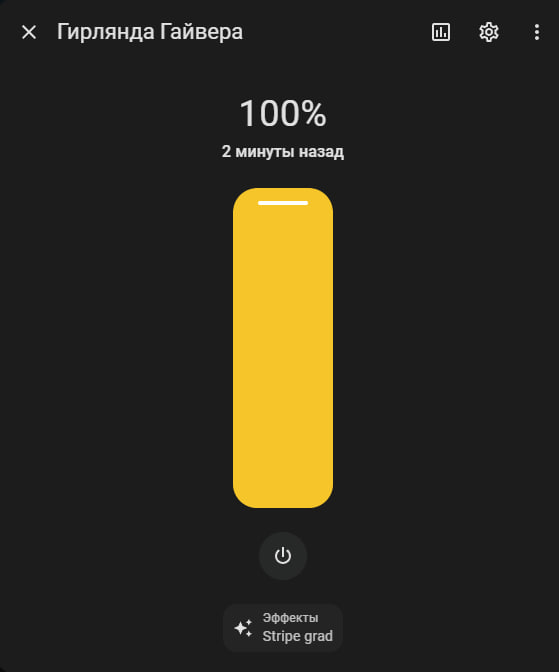

# GyverTwink для Home Assistant

<!-- [](https://github.com/custom-components/hacs) -->

Компонент интеграции [Home Assistant][1] с [умной гирляндой GyverTwink
][2] [@AlexGyver][3]'a.

[1]: https://www.home-assistant.io/
[2]: https://alexgyver.ru/gyvertwink/
[3]: https://alexgyver.ru/about_gyver/

Компонент работает со стандартной прошивкой гирлянды.

Поддерживается:

- включение/выключение гирлянды
- установка яркости
- установка эффекта из списка



## Установка

**Способ 1.** [HACS](https://hacs.xyz/)

> HACS > Интеграции > 3 точки (правый верхний угол) > Пользовательские репозитории > URL: `DeveloperDmitryKolyadin/GyverTwinkHA`, Категория: Интеграция > Добавить > подождать > GyverTwink > Установить

**Способ 2.**

Вручную скопируйте папку `gyvertwink` из [latest release](https://github.com/DeveloperDmitryKolyadin/GyverTwinkHA/releases/latest) в директорию `/config/custom_components`.

## Настройка


**Способ 1.** GUI

> Настройки > Интеграции > Добавить интеграцию > **GyverTwink**

Если интеграции нет в списке - очистите кэш браузера.

**Способ 2.** YAML

```yaml
light gyvertwink:
- platform: gyvertwink
  host: 192.168.1.123 # ip из приложения гирлянды
  name: Гирлянда Гайвера
```

## Поддержка

Если у вас возникли сложности или вопросы по использованию проекта, создайте
[обсуждение](https://github.com/DeveloperDmitryKolyadin/GyverTwinkHA/issues/new/choose) в данном репозитории или напишите мне в телеграме [@DeveloperDK](https://t.me/DeveloperDK)

## Полезные ссылки

- [GyverTwinkApi](https://github.com/DeveloperDmitryKolyadin/GyverTwinkApi) - Модуль на python для упрвления гирляндой (Мой проект)
- [GyverTwink](https://github.com/AlexGyver/GyverTwink) - страница проекта [@AlexGyver](https://github.com/AlexGyver)
- [Yandex Smart Home](https://docs.yaha-cloud.ru/v0.6.x/) - Компонент HA, позволяет добавить устройства из Home Assistant в платформу умного дома Яндекса (УДЯ) и управлять ими с любого устройства с Алисой. (Протестированно управление гирляндой через алису)
